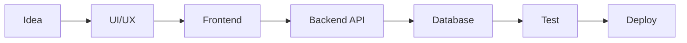

  

<h1 align="center">Assalomu alaykum, men dasturchiman</h1>

  Zamonaviy web ilovalar, tezkor interfeyslar va ishonchli backend tizimlar yarataman.
  Maqsadim: foydalanuvchiga qulay, biznesga foydali va kod bazasi toza bo'lgan mahsulotlar qurish.

  
  
  
  

---

## Men haqimda

- Frontend va backend yo'nalishida real loyihalar ustida ishlayman.
- UI/UX, performance, clean architecture va database design men uchun muhim.
- API, authentication, dashboard, admin panel, e-commerce va SaaS turidagi tizimlarni quraman.
- Har kuni yangi texnologiyalarni o'rganib, amaliyotda sinab boraman.
- Kod yozishda oddiylik, tezlik va barqarorlikni birinchi o'ringa qo'yaman.

 

---

## Texnologiyalar

  
  
  
  
  
  
  
  

  
  
  
  
  
  
  
  

  

---

## Kuchli tomonlar

<table>
  <tr>
    <td width="33%">
      <h3 align="center">Frontend</h3>
      
Responsive UI, component architecture, state management, performance optimization.

    </td>
    <td width="33%">
      <h3 align="center">Backend</h3>
      
REST API, authentication, database modeling, security, scalable services.

    </td>
    <td width="33%">
      <h3 align="center">Product</h3>
      
Real user flows, clean dashboard, useful features, maintainable project structure.

    </td>
  </tr>
</table>

---

## Loyihalar

<table>
  <tr>
    <td width="50%">
      <h3>Dashboard Platform</h3>
      
Admin panel, analytics, role-based access va real-time monitoring imkoniyatlariga ega boshqaruv tizimi.

      

        
        
        
      

    </td>
    <td width="50%">
      <h3>E-Commerce App</h3>
      
Catalog, cart, payment flow, order tracking va admin boshqaruvga ega savdo platformasi.

      

        
        
        
      

    </td>
  </tr>
  <tr>
    <td width="50%">
      <h3>CRM System</h3>
      
Mijozlar, sotuvlar, vazifalar va hisobotlarni boshqarish uchun biznesga yo'naltirilgan CRM.

      

        
        
        
      

    </td>
    <td width="50%">
      <h3>Portfolio Website</h3>
      
Shaxsiy brend, case study, xizmatlar va kontaktlar uchun tezkor va chiroyli web sahifa.

      

        
        
        
      

    </td>
  </tr>
</table>

---

## GitHub statistikasi

  
  

  

---

## Ishlash jarayonim

---

  

# mernstack01
