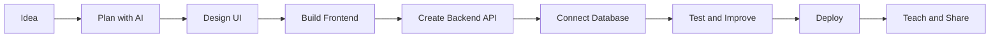

  

<h1 align="center">Hi, I'm a Full-Stack Developer focused on real-world products</h1>

  I build modern web apps, scalable backend systems, mobile experiences, and practical learning content.
  I also work strongly with AI tools to move faster, write cleaner code, and turn ideas into working products.

  
  
  
  

---

## About Me

- I create clean, responsive, and user-friendly frontend interfaces.
- I build backend APIs, authentication systems, databases, dashboards, and business logic.
- I develop mobile-ready experiences and cross-platform app ideas.
- I teach programming in a simple, practical, and project-based way.
- I work very well with AI tools for coding, debugging, learning, planning, and automation.
- I care about performance, clean architecture, readable code, and real product value.

 

---

## Main Focus

<table>
  <tr>
    <td width="20%" align="center">
      
      <h3>Frontend</h3>
      
React, Next.js, responsive UI, dashboards, reusable components, and smooth user experience.

    </td>
    <td width="20%" align="center">
      
      <h3>Backend</h3>
      
Node.js, Express, NestJS, REST APIs, authentication, database design, and scalable services.

    </td>
    <td width="20%" align="center">
      
      <h3>Mobile</h3>
      
Mobile-first layouts, React Native concepts, Flutter basics, app flows, and API integration.

    </td>
    <td width="20%" align="center">
      
      <h3>Teaching</h3>
      
Clear explanations, beginner-friendly lessons, coding practice, and project-based learning.

    </td>
    <td width="20%" align="center">
      
      <h3>AI</h3>
      
AI-assisted coding, prompts, automation, debugging, documentation, and faster development workflows.

    </td>
  </tr>
</table>

---

## Tech Stack

  
  
  
  
  
  
  
  

  
  
  
  
  
  
  
  

  
  
  
  
  
  
  
  

  

---

## What I Build

<table>
  <tr>
    <td width="50%">
      <h3>Frontend Products</h3>
      
Landing pages, portfolios, dashboards, admin panels, SaaS interfaces, e-commerce UI, and high-quality responsive layouts.

      

        
        
        
      

    </td>
    <td width="50%">
      <h3>Backend Systems</h3>
      
REST APIs, authentication, role-based access, database models, file uploads, payment flows, and business automation.

      

        
        
        
      

    </td>
  </tr>
  <tr>
    <td width="50%">
      <h3>Mobile Experiences</h3>
      
Mobile-first web apps, React Native app structure, Flutter UI basics, API-connected screens, and smooth user flows.

      

        
        
        
      

    </td>
    <td width="50%">
      <h3>Teaching & AI Workflows</h3>
      
Programming lessons, practical projects, AI prompts, code reviews, documentation, debugging help, and productivity workflows.

      

        
        
        
      

    </td>
  </tr>
</table>

---

## AI-Powered Development

I use AI as a strong development partner, not just a chatbot. My workflow includes:

- planning features and breaking large ideas into clear steps;
- generating clean starter code and improving it with human review;
- debugging errors faster with better context;
- writing documentation, README files, lessons, and explanations;
- creating prompts for coding, learning, automation, and product thinking;
- improving productivity while keeping code quality, security, and maintainability in focus.

---

## GitHub Stats

  
  

  

---

## Workflow

---

  

